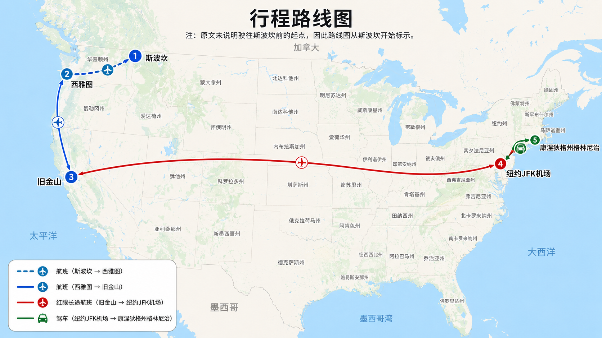

上篇文章中提到：**人在青少年时期要有意识地通过一些经历丰富自己面对困难时主观体验，这种体验有助于增强一种信念，人生中发生的事情在很大程度上由自己掌控。**

人的出身各不相同：极少数生于富贵或官宦之家；大多数为普通（工薪）家庭；甚至有一出生条件极差（俗称天生一副烂牌）的。

第一种出身的我们就不讨论了，参考价值极低，比如我们不会傻到非要跟比尔·盖茨比童年，比出身。

后两种出身且事业有成的，其奋斗历程或成长轨迹大致分为三种类型。

第一种：父母为工薪阶层，但很睿智，懂得如何培养孩子坚韧不拔的品格。

史蒂夫·杨(Steve Young)曾是美国国家橄榄球联盟（National Football League，简称NFL）的一名成员，他当年效力于旧金山49人队。在第二十九届超级碗比赛中，斯蒂夫有六次传球让该队直接得分。退役时，他的四分卫传球评分为NFL历史第一。

这么亮眼的战绩是如何取得的呢？

史蒂夫十三岁上中学时，参加了校棒球队。整个赛季，他发挥得很差，觉得越来越丢人。回到家他告诉父亲再也不想打棒球了。父亲不同意，并且跟他一起返回了球场。当时是冬天，天气非常冷，父亲不断地投球，斯蒂夫不断地击球。到高中毕业时，斯蒂夫已是校棒球队队长。

为什么父亲这么坚持？因为他们家有一个铁的纪律：

> **无论报名参加什么活动，一旦开始，就必须坚持到底。一旦作出承诺，就必须约束自己，坚持完成**。（whatever they signed up for, they had to see it through to the end.Once you commit, you discipline yourself to do it. ）

睿智的父母，不光对孩子有严格的要求，还在必要时提供足够的支持。斯蒂夫九岁时参加青少年橄榄球赛，对方一名球员勒住他的脖子把他摁在地上，这是斯蒂夫的母亲大步向前，一把抓住那个男孩的护肩，并严厉警告对方下不为例。斯蒂夫的爸爸有一次出差，星期五晚上忙完后当地机场因大雾取消了所有航班。为了回到家跟孩子们待在一起，这位父亲先是租了一辆车开到能坐飞机的一个城市，然后飞往西雅图，紧接着乘坐第二趟航班飞往旧金山，接下来第三趟航班降落在肯尼迪机场。最后租车开回家。

大多数人碰到这种情况，估计会待在原地，打电话给家里说明情况：……我这周末不回家了。

有没有人小时候不愿意上学，被家里人硬拖着去了学校然后一个人待在那里哭的？史蒂夫二年级时拒绝去学校，妈妈在教室里陪着他过了好几周，直到斯蒂夫可以安心独自上学。

我们来看看既充满爱意又有明确要求的父母培养出的孩子是什么样的。

史蒂夫曾是高中橄榄球队的明星球员，当时很多大学向他抛出橄榄枝。进入杨百翰大学（Brigham Young University）后，橄榄球队一共有八名四分卫，斯蒂夫排在最后，他几乎没有机会上场。后来，教练把他降到了陪练队，就像电影里的跑龙套。史蒂夫非常郁闷，整个第一学期他唯一的念头就是想回家。他在电话中跟父亲吐槽：教练连他的名字都不知道，他不过是别人用来练习防守的一个大号人肉沙袋。父亲队他说：

> 你可以退出……但你不能回家，因为我不会跟一个半途而废的人住在一起。你从小就知道这一点。你不能回来（You can quit. … But you can’t come home because I’m not going to live with a quitter. You’ve known that since you were a kid. You’re not coming back here.）。

史蒂夫留了下来，整个赛季他第一个来最后一个离开。不光如此，球队最后一场比赛结束后，他自己加大了训练强度。接下来近两个月的时间，他练习螺旋传球一万多次，胳膊疼的厉害。付出终于有了收获，大二时，史蒂夫在八名四分卫中排名第二。大三时他成为杨百翰大学首发四分卫，大四时他被评为全美最杰出的大学四分卫。

后来的运动生涯中，每逢信心动摇史蒂夫都会去找父亲，后者从不允许他放弃。进入旧金山四十九人队后，史蒂夫曾坐了四年冷板凳。无数个漫漫长夜，他始终没有动摇。因为长期的家庭环境的熏陶以及自身早年的经历早已让他坚信：**坚持不懈，终有回报**。四十九人队当时的首发四分卫是乔·蒙塔纳，他曾带队四次夺取超级碗冠军，史蒂夫默默向其学习，若干年后终于取得了辉煌的战绩。

在对孩子充满关爱这方面，大部分人都同意。但提到严格要求，有人难免生出疑惑：对孩子管教太严，这不就是专制型父母吗？

关键在于，父母是出于爱，还是想控制孩子？这一点孩子最有发言权。杨百翰大学第一学期的经历，史蒂夫是这样想的：

